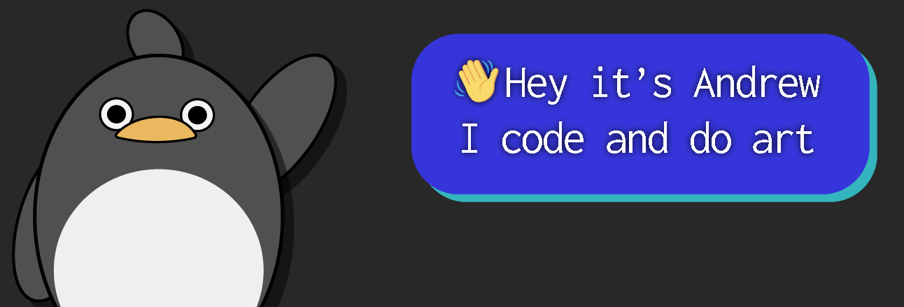

---

- 📌 Incoming **SWE intern** [@**Intuit**](https://www.intuit.com/) | **Full-Stack Dev** [@**Zero RampUp**](https://zerorampup.com/)
- 📜 Former **Research Assistant** [@**University of Alberta**](https://www.ualberta.ca/index.html)
- 🔍 Looking into **Games AI** 
- 💻 Maintaining [**lua-runner**](https://github.com/Zeyu-Li/lua-runner) - a NPM package with 
- ✨ Interested in making 3D renders, vector art, and electronic music 
- 💖​ Love to **collaborate** on projects

## 🧭 Learn More

To find out more about me or if you want to get in contact, check out my [🌐 **website**](https://andrewli.site/) and my [📰 **blog** here](https://blog.andrewli.site/)! 

## 🗨 Languages + 🛠 Tools 

<!-- img/icons from devicon.dev, icons8.com, or vectorlogo.zone -->

|     **:hibiscus: Frontend**     |            |
| :----------------------------- | :------------------------------------------------------------: |
|     **:briefcase: Backend**     |            |
| **:books: Libraries/Frameworks** |          |
|        **:art: Design**         |         |
|      **:video_game: Game**      |    |
| **:star2: Other** |            |
|       **:book: Learning**       |     |

----

    
<b>
📊 GitHub Stats
        </b>

# 🧾 Notable Repos

    
 

