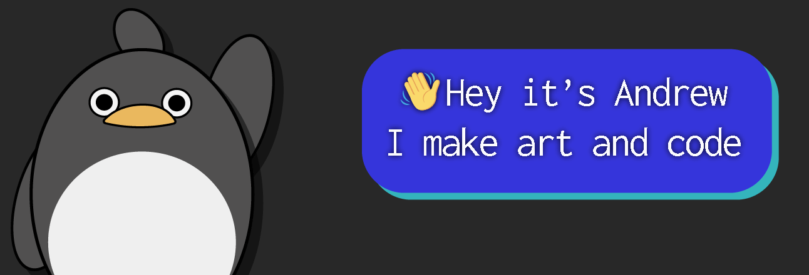

---

- 📌 Currently a **Research Assistant** at the **University of Alberta**
- 🔍 Looking into **Reinforcement Learning** 🤖
- 💻 Maintaining [**lua-runner**](https://github.com/Zeyu-Li/lua-runner) - a NPM package with 
- ✨ Interested in making 🎨 3D renders, 🌟 vector art, and :musical_note: electronic music 
- 💖​ Love to **collaborate** on projects

## 🧭 Learn More

To find out more about me and if you want to get in contact, check out my [🌐 **website**](https://zeyu-li.github.io/website/) or my [📰 **blog** here](https://andrew-li-blog.vercel.app/)! 

If you want to support me in making more fun and maniacal open source projects, consider donating [here](https://github.com/sponsors/Zeyu-Li)

## 🗨 Languages + 🛠 Tools 

<!-- img/icons from devicons.github.io, icons8.com, or vectorlogo.zone -->

|     **:hibiscus: Frontend**     |        |
| :----------------------------- | :------------------------------------------------------------: |
|     **:briefcase: Backend**     |        |
| **:books: Libraries/Frameworks** |      |
|        **:art: Design**         |        |
|      **:video_game: Game**      |   |
| **:star2: Other** |         |
|       **:book: Learning**       |   |

    
<b>
📊 GitHub Stats
        </b>

# 🧾 Repos

 